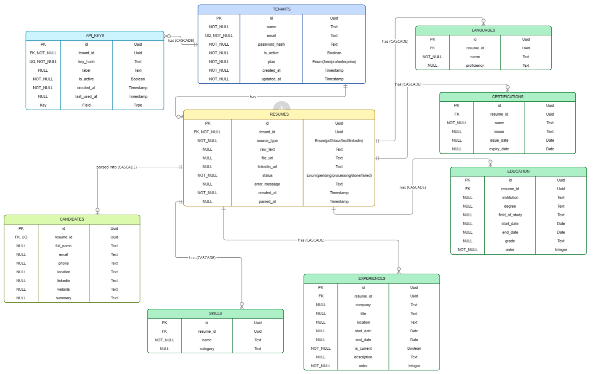

# Resume Parser API

A multi-tenant REST API that accepts resumes in multiple formats and returns clean, structured JSON data using Grok AI. Built with Django, Django REST Framework, Celery, Redis, and PostgreSQL.

This is an open source project, and contributions are welcome. Feel free to fork the repository, create a new branch, implement additional features such as payment integration or other relevant improvements, commit your changes, and submit a pull request (PR) for review.

NB: In this project, we use Grok (Groq) for AI API calls.

There is also an option to use Anthropic, but it requires billing to be set up. If you’re able to use it, please visit https://platform.claude.com/, create an account, add your billing information, create and API key and copy it into your environment variables as ANTHROPIC_API_KEY.

If you prefer using Grok, no problem—simply sign up at https://console.groq.com/
, Create an API key, and add it to your environment variables as GROQ_API_KEY.

---

## Table of Contents

- [Overview](#overview)
- [Features](#features)
- [Tech Stack](#tech-stack)
- [Database schema diagram](#database-schema-diagram)
- [Getting Started](#getting-started)
- [Environment Variables](#environment-variables)
- [API Documentation](#api-documentation)
- [Authentication](#authentication)
- [Rate Limiting](#rate-limiting)
- [Running Tests](#running-tests)

---

## Overview

The Resume Parser API allows developers to submit resumes in PDF, DOCX, plain text, or LinkedIn URL format. The API extracts raw text from the file, sends it to an AI model with a structured extraction prompt, and saves the result across normalised database tables. Developers can then fetch the result as clean JSON.

Each developer registers an account and receives an API key. All resume endpoints are authenticated via this API key. Account management endpoints are protected via JWT tokens.

---

## Features

- Multi-tenant architecture — each developer has their own isolated account and data
- Resume parsing from PDF, DOCX, plain text, and LinkedIn URL
- AI-powered structured data extraction using Groq (LLaMA 3)
- Asynchronous background processing via Celery and Redis
- Plan-based rate limiting — Free, Pro, and Enterprise tiers
- API key management — create, list, update, and revoke keys
- JWT authentication for account management
- Auto-generated Swagger documentation via drf-spectacular
- Fully Dockerised development environment

---

## Tech Stack

| Tool                  | Role                            |
| --------------------- | ------------------------------- |
| Django                | Web framework                   |
| Django REST Framework | REST API                        |
| PostgreSQL            | Main database                   |
| Redis                 | Task queue + rate limit counter |
| Celery                | Background task worker          |
| Groq                  | AI resume parsing (LLaMA 3)     |
| pdfplumber            | PDF text extraction             |
| python-docx           | DOCX text extraction            |
| simplejwt             | JWT authentication              |
| drf-spectacular       | Swagger documentation           |
| Docker                | Containerised development       |

---

## Database schema diagram



---

## Getting Started

### Prerequisites

- python 3
- Docker
- Docker Compose

### 1. Clone the repository

```bash
git clone https://github.com/yourusername/resume-parser-multi-tenant-api.git
cd resume-parser-multi-tenant-api
```

### 2. Create your environment file

```bash
cp .env.example .env
```

### 3. Fill in your `.env` file

```bash
SECRET_KEY=your-secret-key-here
DB_HOST=db
DB_NAME=resumedb
DB_USER=resumeuser
DB_PASS=resumepass
DB_PORT=5432
ALLOWED_HOSTS=127.0.0.1,localhost,0.0.0.0
REDIS_URL=redis://redis:6379/0
CELERY_BROKER_URL=redis://redis:6379/0
GROQ_API_KEY=your-groq-api-key-here
```

### 4. Build and run

```bash
docker compose up --build
```

### 5. Access the API

```
API Base URL:     http://127.0.0.1:8000/api/v1/
Swagger Docs:     http://127.0.0.1:8000/api/docs/
Django Admin:     http://127.0.0.1:8000/admin/
```

---

## Environment Variables

| Variable            | Description                   | Required |
| ------------------- | ----------------------------- | -------- |
| `SECRET_KEY`        | Django secret key             | Yes      |
| `DB_HOST`           | PostgreSQL host               | Yes      |
| `DB_NAME`           | PostgreSQL database name      | Yes      |
| `DB_USER`           | PostgreSQL username           | Yes      |
| `DB_PASS`           | PostgreSQL password           | Yes      |
| `DB_PORT`           | PostgreSQL port               | Yes      |
| `ALLOWED_HOSTS`     | Comma separated allowed hosts | Yes      |
| `REDIS_URL`         | Redis connection URL          | Yes      |
| `CELERY_BROKER_URL` | Celery broker URL             | Yes      |
| `GROQ_API_KEY`      | Groq API key for AI parsing   | Yes      |

---

## API Documentation

Full interactive documentation is available at `/api/docs/` when the server is running.

---

### Authentication Endpoints

| Method | Endpoint                        | Auth | Description                 |
| ------ | ------------------------------- | ---- | --------------------------- |
| POST   | `/api/v1/tenant/create/`        | None | Register a new account      |
| POST   | `/api/v1/tenant/login/`         | None | Login and receive JWT token |
| POST   | `/api/v1/tenant/token/refresh/` | None | Refresh JWT access token    |
| GET    | `/api/v1/tenant/me/`            | JWT  | Get your profile            |
| PATCH  | `/api/v1/tenant/me/`            | JWT  | Update your profile         |
| DELETE | `/api/v1/tenant/me/`            | JWT  | Delete your account         |

---

### API Key Endpoints

| Method | Endpoint                    | Auth | Description            |
| ------ | --------------------------- | ---- | ---------------------- |
| GET    | `/api/v1/tenant/keys/`      | JWT  | List all your API keys |
| POST   | `/api/v1/tenant/keys/`      | JWT  | Generate a new API key |
| PATCH  | `/api/v1/tenant/keys/<id>/` | JWT  | Update a key label     |
| DELETE | `/api/v1/tenant/keys/<id>/` | JWT  | Revoke an API key      |

---

### Resume Endpoints

| Method | Endpoint                | Auth    | Description                 |
| ------ | ----------------------- | ------- | --------------------------- |
| POST   | `/api/v1/resumes/`      | API Key | Submit a resume for parsing |
| GET    | `/api/v1/resumes/`      | API Key | List all your resumes       |
| GET    | `/api/v1/resumes/<id>/` | API Key | Get full parsed result      |
| DELETE | `/api/v1/resumes/<id>/` | API Key | Delete a resume             |

---

## Authentication

The API uses two types of authentication:

### JWT Token

Used for account management endpoints. Obtain by calling `POST /api/v1/tenant/login/`.

Include in requests as:

```
Authorization: Bearer your_access_token
```

### API Key

Used for resume parsing endpoints. Generated automatically on registration and can be managed via the keys endpoints.

Include in requests as:

```
X-API-Key: rpa_your_api_key
```

---

## Rate Limiting

Rate limits are applied per tenant per day based on their plan:

| Plan       | Daily Limit          |
| ---------- | -------------------- |
| Free       | 100 resumes per day  |
| Pro        | 1000 resumes per day |
| Enterprise | Unlimited            |

When a limit is exceeded the API returns `429 Too Many Requests`. The limit resets at midnight UTC.

---

## Resume Parsing Flow

```
1. Developer submits resume via POST /api/v1/resumes/
2. API validates input and saves resume with status = pending
3. Celery background task is queued
4. API returns 202 Accepted with resume_id immediately
5. Celery worker picks up the task
6. Text is extracted from the file
7. Raw text is sent to Groq AI with a structured prompt
8. AI returns structured JSON
9. Data is saved across normalised tables
10. Resume status updated to done
11. Developer fetches result via GET /api/v1/resumes/<id>/
```

---

## Supported Resume Formats

| Format       | How it works                     |
| ------------ | -------------------------------- |
| PDF          | Text extracted using pdfplumber  |
| DOCX         | Text extracted using python-docx |
| Plain text   | Used directly as raw text        |
| LinkedIn URL | URL passed as context to the AI  |

---

## Running Tests

```bash
docker compose run --rm app sh -c "python manage.py test"
```

Run tests for a specific app:

```bash
docker compose run --rm app sh -c "python manage.py test user"
docker compose run --rm app sh -c "python manage.py test resume"
docker compose run --rm app sh -c "python manage.py test core"
```

Run linting:

```bash
docker compose run --rm app sh -c "flake8 ."
```

---

## Getting API Keys

### Groq (Free)

1. Go to [console.groq.com](https://console.groq.com)
2. Sign up for a free account
3. Go to API Keys
4. Create a new key and add it to your `.env` file

### Anthropic (Paid — optional)

1. Go to [console.anthropic.com](https://console.anthropic.com)
2. Create an account and add credits
3. Go to API Keys and create a new key
4. Uncomment the Anthropic section in `resume/ai.py`

---

```

```
